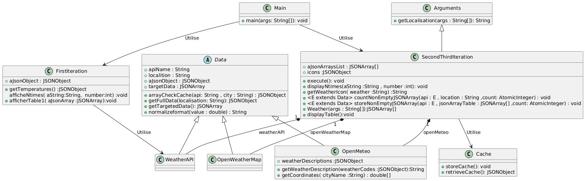
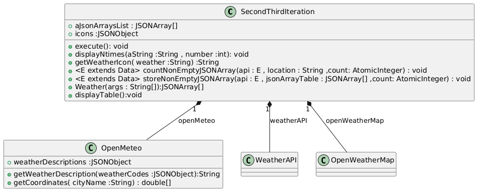

# Document de design

Ceci est le document de template pour décrire l'architecture de votre programme. Vous pouvez le modifier à votre guise, mais assurez-vous de répondre à toutes les questions posées.
***Suivant certaines architectures, certaines des questions peuvent ne pas être pertinentes. Dans ce cas, vous pouvez les ignorer.***
Vous pouvez utiliser autant de diagrammes que vous le souhaitez pour expliquer votre architecture.
Nous vous conseillons d'utiliser le logiciel PlantUML pour générer vos diagrammes.

## Schéma général

Décrivez ici le schéma général de votre programme. Quels sont les composants principaux et comment interagissent-ils?

**Conception**

Notre projet est structuré autour de plusieurs classes. Une classe abstraite, nommée `Data`, définit deux méthodes abstraites : `getTargetedData` et `getFullData`. Ces méthodes sont implémentées différemment en fonction de l'API utilisée. Pour cela, trois classes concrètes ont été développées : `OpenMeteo`, `WeatherAPI`, et `OpenWeatherMap`. Chaque classe propose une implémentation spécifique des méthodes abstraites, adaptée à la manière dont les données sont extraites à partir des objets JSON fournis par leur API respective.

En complément, nous avons une classe concrète `FirstIteration`, qui contient toutes les fonctionnalités nécessaires à la première itération du projet. Les itérations deux et trois sont regroupées dans une autre classe concrète, `SecondThirdIteration`, en raison de leur grande similarité. Cette dernière inclut un système de gestion de cache, pris en charge par la classe concrète `Cache`.

La classe `Main` est responsable de l’exécution du programme, en orchestrant les appels aux différentes classes. Par ailleurs, des classes spécifiques ont été créées pour gérer les exceptions, lesquelles seront abordées plus en détail ultérieurement.

**Diagramme de classes**

Le diagramme de classes ci-dessous illustre la structure du système implémenté pour la gestion des données météorologiques provenant de plusieurs API. Ce modèle est conçu autour de plusieurs classes principales et abstraites, chacune ayant un rôle spécifique dans le processus de collecte, de traitement et d'affichage des données.



**Description des principales classes**

- **`Data` (classe abstraite)** : Cette classe abstraite définit les comportements communs aux différentes sources de données météorologiques. Elle déclare des méthodes abstraites telles que `getFullData()` et `getTargetedData()`, qui sont spécifiques aux API et doivent être implémentées dans les classes concrètes.
    
- **`OpenMeteo`, `WeatherAPI`, `OpenWeatherMap`** : Ces classes concrètes implémentent la classe abstraite `Data`. Chaque classe est responsable de l'extraction des données météorologiques à partir des API respectives, en utilisant des objets `JSONObject` pour manipuler les données obtenues.
    
- **`FirstIteration` et `SecondThirdIteration`** : Ces classes gèrent les itérations du processus de collecte de données. La première itération (`FirstIteration`) se concentre sur l'extraction et l'affichage des températures, tandis que la deuxième et troisième itérations (`SecondThirdIteration`) s'occupent de la gestion de l'affichage des données sous forme de tableau et de la gestion du cache.
    
- **`Arguments`** : Cette classe permet de traiter les arguments passés en ligne de commande, notamment la localisation de la ville dont on veut obtenir les données météorologiques. Elle lance des exceptions si les arguments sont mal fournis.
    
- **`Cache`** : La classe `Cache` permet de stocker et de récupérer les données en cache afin d'améliorer les performances lors des requêtes répétées.
    
- **Exceptions (Non incluses dans le diagramme)** : Deux classes d'exception sont définies dans le système :
  - `ArgumentException` : Lève une exception si les arguments fournis sont invalides.
  - `WeatherFetchingException` : Gère les erreurs liées à l'extraction des données météorologiques depuis les API.

**Relations entre les classes**

Les relations entre les différentes classes sont représentées par des associations et des héritages. Par exemple, `SecondThirdIteration` utilise des instances des classes `WeatherAPI`, `OpenMeteo`, et `OpenWeatherMap` pour interagir avec les différentes API. De plus, des exceptions sont utilisées pour gérer les erreurs lors de l'exécution du programme, notamment pour les erreurs liées aux arguments ou à l'extraction des données.


## Utilisation du polymorphisme

Comment utilisez-vous le polymorphisme dans votre programme?

## Utilisation de la déléguation

Comment utilisez-vous la délégation dans votre programme?


La classe `SecondThirdIteration` utilise la délégation pour interagir avec les classes API (`OpenMeteo`, `WeatherAPI`, `OpenWeatherMap`) et la classe `Cache`. Cela permet une séparation claire des responsabilités, où chaque classe est responsable de ses propres fonctionnalités spécifiques.




## Utilisation de l'héritage

Comment utilisez-vous l'héritage dans votre programme?


L'héritage est utilisé pour créer une hiérarchie de classes à partir de la classe abstraite `Data`. Cette classe sert de base pour les implémentations des différentes API. L'héritage permet également de factoriser le comportement commun (comme `normalizeformat`) dans la classe parente.


## Utilisation de la généricité

Comment utilisez-vous la généricité dans votre programme?

La généricité est utilisée dans la classe `SecondThirdIteration` pour les méthodes `countNonEmptyJSONArray` et `storeNonEmptyJSONArray`. Ces méthodes acceptent tout type de classe qui étend `Data`, permettant ainsi une flexibilité et une réutilisabilité accrues.

```java
// Exemple de méthode générique pour compter les tableaux JSON non vides
public <E extends Data> void countNonEmptyJSONArray(E api, String location, AtomicInteger count) {
    api.arrayCheckCache(api.apiName, location);
    if (api.targetData == null || api.targetData.length() != 0) {
        count.incrementAndGet();
    }
}

```

## Utilisation des exceptions

Comment utilisez-vous les exceptions dans votre programme?

Dans notre projet, la gestion des exceptions est un aspect clé pour assurer la robustesse de l'application. Nous avons implémenté des classes d'exception personnalisées pour gérer les erreurs spécifiques qui peuvent survenir lors de l'exécution du programme.

** Classe `ArgumentException` **

La classe `ArgumentException` est utilisée pour gérer les erreurs liées aux arguments de la ligne de commande. Elle est levée si l'utilisateur ne fournit pas les arguments attendus ou si la syntaxe des arguments est incorrecte. Cette exception permet de signaler de manière claire et précise les erreurs liées à la saisie des paramètres nécessaires à l'exécution du programme. Elle est utilisée dans la classe `Arguments` pour vérifier que les informations, telles que le nom de la ville, ont bien été fournies.

Lorsqu'une commande incorrecte est lancée en ligne de commande :

```bash
./gradlew --args="-l "
```


** Classe `WeatherFetchingException` **
La classe WeatherFetchingException est utilisée pour gérer les erreurs qui surviennent
lors de la récupération des données météorologiques depuis les différentes API. Elle
permet de capturer des erreurs telles que des problèmes de connexion aux API. Cette
exception est levée chaque fois qu’une API météo ne répond pas correctement.

